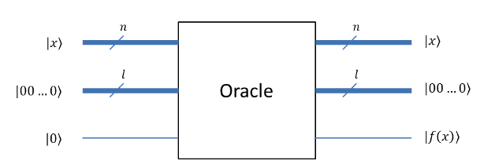
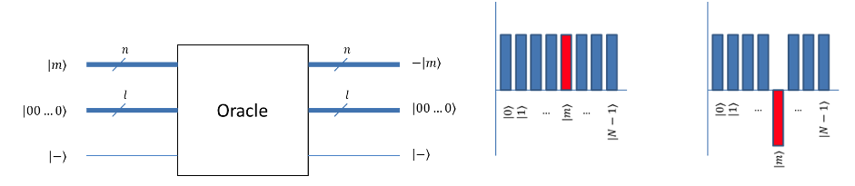
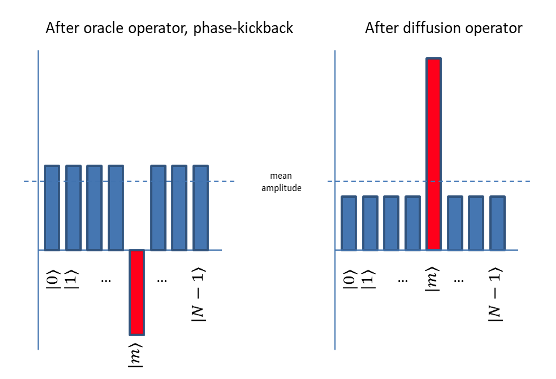
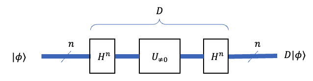
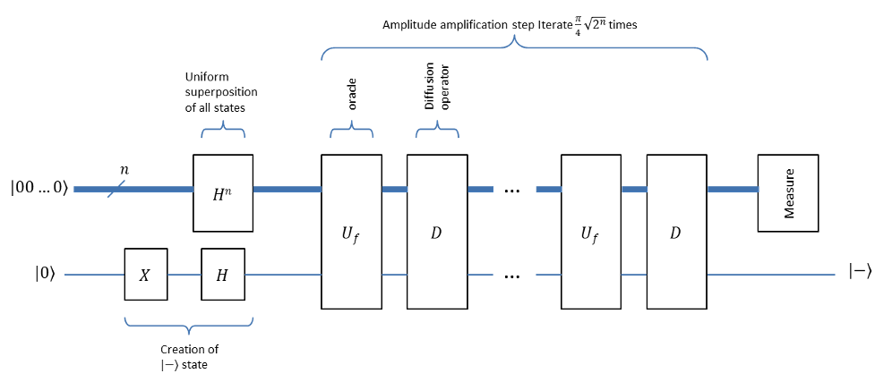
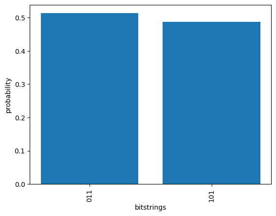

<h1 style="text-align: center;">
Grover's Algorithm: Quantum Speedup of Unstructured Search
</h1>

In this post, we take an educational approach for a well-known quantum
algorithm, *Grover's algorithm*. We'll first explain how Grover's
algorithm works, then we'll introduce the *dinner party problem* which
involves identifying a set of friends that can be invited together to a
party satisfying a set of constraints. And then we'll explain how
Grover's algorithm can be used to solve it.

[Grover's algorithm](https://en.wikipedia.org/wiki/Grover%27s_algorithm)
is a widely cited and historically important quantum algorithm. It was a
significant early milestone that helped demonstrate the potential power
of quantum computers. It's arguably almost as well-known as Shor's
factoring algorithm. It's primarily used for searching in unstructured
search spaces and provides a quadratic speedup over classical algorithms
for this category of problems. Theoretically it can be applied to areas
like cryptanalysis, optimization problems, machine learning, or quantum
simulation. While the practical use of Grover's algorithm is currently
limited by the availability of large-scale, fault-tolerant quantum
computers, it's a great choice for learning and exploring ideas involved
in quantum computing.

## Unsorted search on classical computers, and the idea of "oracles"

Let's first see how classical computers search a number in an unsorted
list. As an example, given an unsorted array
$(3,6,1,9,7,8,5,0,2,4)$, we need to write an algorithm that
finds the index at which the number 2 is sitting. Checking one-by-one
from left to right would take 9 tries in this list.

Checking for the match can be seen as a call to a function which returns
$\text{True}$ if the input is 2, else returns $\text{False}$. If we start from index 0 and
go sequentially, we'd call the function 9 times before we found 2 at
index 8 in the list. On average, we'll need to check in the range of $N$
numbers $N/2$ times. In other words, it has time complexity of $O(N)$.
However, on a quantum computer, you can perform this search in time
complexity of $O(\sqrt{N})$ using Grover's algorithm.

### Oracles

An 'oracle' is a function that entirely contains the validation logic
that defines the search problem. An example is the function we just
mentioned in the previous paragraph. Such operations can be defined as a
classical Boolean function $f:\left\{ 0,1 \right\}^{n} \rightarrow \left\{ 0,1 \right\}$, which takes an n-bit binary input and -- for this discussion -- produces a 1-bit binary output.

So, considering our example problem again, we want a function, $f$, that
takes an index between 0-9, and returns $\text{True}$ if the item at the
indexed position is 8 in the underlying array, i.e. $f(8)\  = \ True$.

### Quantum oracles

Oracles in quantum computing are implemented by quantum functions, all
of which are unitary operations whose inputs and outputs have the same
number of qubits. As shown in Figure below, for a quantum oracle with $n$
input qubits and $1$ output qubits, we need to send in both the input
qubits *and* the output qubits to the oracle, so we need $n+1$ qubits. In
addition to these, the oracle might use additional $l$ qubits as work
qubits that hold some intermediate values during the computation. Thus,
the oracle would use $n+1+l$ qubits in total.



*Figure: Quantum oracle with a binary output*

## Unsorted search on quantum computers -- Grover's algorithm

Now, on to unsorted search on quantum computers using Grover's
algorithm. Let's look at how this algorithm takes advantage of
superposition, entanglement, and interference in quantum computers to
perform the search more efficiently than classical computers.

At the heart of Grover's algorithm are two operators: the *oracle* and
*Grover's diffusion operator*. Let's go over each of these in the next
sections.

### The oracle

For the problem of searching in a range, the oracle on a quantum
computer takes as input, a number encoded in binary, and toggles an
output qubit if the input number is the correct answer (e.g. $f(8) = \text{True}$
in our example where we're searching for the index of $8$ in the array
$[3,6,1,9,7,8,5,0,2,4]$).

However, the qubits can be in a superposition of multiple bit-strings.
If the input is in such a superposition, the quantum oracle puts the
output qubit also in a superposition, such that the output qubit is
toggled/not-toggled, in alignment with the individual states in the
input superposition. The output qubit gets entangled with the input
qubits.

Let's illustrate that using an oracle with $2$ qubits as input and $1$ qubit
as output. The input can have $4$ possible values, and if the input is in
a uniform superposition of these, it will be as follows (where square of
amplitudes of all states must add up to $1$):

$1/2 (\ket{00} +\ket{01} +\ket{10} +\ket{11})$

If we initialize the output qubit to $\ket{0}$, the overall state at the
beginning will be as follows (the output qubit is shown as
most-significant):

$1/2 (\ket{000} +\ket{001} +\ket{010} +\ket{011})$

Suppose the number the oracle matches is $2$ (i.e., $\ket{10}$), so, $f(2) =
\text{True}$, and $f(0)=f(1)=f(3)=\text{False}$. With this, state after the oracle operator would be:

$1/2 (\ket{000} + \ket{001} + \ket{110} + \ket{011})$

Note that the qubits are now entangled: the output qubit is $\ket{1}$ only
when the input qubits are in $\ket{10}$ state, and $\ket{0}$ otherwise.

This seems to already solve the search problem, right? No. To be able to
find out the qubit values for which the output qubit is $\ket{1}$, we'll
have to perform a measurement operation. Since the amplitudes of all the
states is the same, we have equal probability of measuring any one of
these answers. If we have $n$ qubits, addressing $2^n=N$ input bit
combinations, the amplitudes would be $(1/\sqrt{N})$, and the probability
(square of the amplitude) of measuring the state with output qubit as
$\ket{1}$ is $(1/N)$, i.e., still $O(N)$ tries required; so, no real benefit
so far.

To bring about the promised speedup, Grover's algorithm uses the
mentioned diffusion operator along with an oracle to increase the
amplitude of the desired state, and in doing so increases the
probability of measuring that state.

### Phase kickback

Let's cover one more useful concept in the context of oracles: *the phase
kickback*.

Say an oracle, only for a particular input state $\ket{m}$, toggles the
output qubit. That is,

$\ket{0}\ket{m} \xrightarrow{Oracle} \ket{1}\ket{m}, and$

$\ket{1}\ket{m} \xrightarrow{Oracle} \ket{0}\ket{m}$

Now consider the situation where the output qubit is not in state $\ket{0}$
but is instead prepared to be in superposition state $\frac{1}{\sqrt{2}} ( \ket{0} -\ket{1} )$
(also known as $\ket{-}$ state). Applying the oracle operation to this
results in an interesting outcome as follows,

$\frac{1}{\sqrt{2}} (\ket{0}-\ket{1})\ket{m} \xrightarrow{Oracle} \frac{1}{\sqrt{2}} (\ket{1}-\ket{0})\ket{m} = \frac{1}{\sqrt{2}} (\ket{0}-\ket{1})(-\ket{m})$

As you see, the operation changes the *sign* of the overall state, which
is the same as leaving the output qubit *as-is*, and inverting the sign
of the input state $\ket{m}$.



*Figure: Oracle operator with phase kick-back, visual depiction of
phase-kick-back*

Thus, if the input is in a uniform superposition of all states, the
oracle inverts the sign of $\ket{m}$, leaving all others unchanged. We can
plot the amplitudes of the states before and after the operator, as
we've done in figure above.

### Diffusion operator

This second operator, known as the *diffusion operator*, or *amplitude
amplification operator* is the key idea behind Grover's algorithm.

The diffusion operator essentially creates a series of rotations which
amplifies *only* the phase flipped state. This operator -- used along
with the oracle with phase-kickback -- amplifies the amplitude of the
target state as depicted in figure below. Grover's diffusion operator can be described as 'flipping the amplitudes
around the mean'.



*Figure: Amplitude amplification by Grover's diffusion operator*

 Let's illustrate the concept using a simple example.
Let's say we have the input in an equal superposition as:

$$\left\lbrack \frac{1}{2},\frac{1}{2},\frac{1}{2},\frac{1}{2} \right\rbrack$$

and we want to find the 3<sup>rd</sup> element. Note that generally the
amplitudes will be complex but we're using real numbers here for
simplicity.

By applying the oracle (along with phase kickback), the 3^rd^
amplitude's sign is changed

$$\left\lbrack \frac{1}{2},\frac{1}{2}, - \frac{1}{2},\frac{1}{2} \right\rbrack$$

The mean of these amplitudes is

$$avg = \frac{\frac{1}{2} + \frac{1}{2} - \frac{1}{2} + \frac{1}{2}}{4} = \frac{1}{4}$$

Applying Grover's diffusion operator flips all the amplitudes around
this mean. So, for an initial amplitude $a$, the resulting amplitude
will be $(2*avg - a)$. Thus, for $a=\frac{1}{2}$, the resulting amplitude is
$0$, and for $a=-\frac{1}{2}$, it's $1$. Hence, the overall the result is

$$\left\lbrack 0,0,1,0 \right\rbrack$$

We can now see that the 3<sup>rd</sup> element's amplitude is amplified, hence
increased the probability of measuring the correct element -- in this
example to a probability of $1$.

So, by applying this pair of oracle and diffusion operators repeatedly,
it's possible to amplify the amplitude of the target state till it gets
to, or very near, $1$. Performing measurement now yields the result $m$
with a high probability.



*Figure: Grover's Diffusion Operator*

Figure above shows a diagram of the diffusion operator. $H^n$ is the
Hadamard gate individually applied on each of the $n$ qubits, $U_{\neq 0}$
inverts the phase of the input qubits if the input qubits are not
$\ket{00...0}$.

### Putting it all together

Putting it all together, the quantum circuit for Grover's algorithm is
as we've depicted in Figure 6, and its sequence of five steps are
explained like this:

1.  **Initialize**: Input register qubits are put in uniform
    superposition of all states by applying $H$ gate to each of those
    qubits. This leads to all the input register states having equal
    amplitude. Also, to effect phase kick-back, the output qubit is put
    in $\ket{-}$ state by applying the $X$ gate followed by the $H$.

2.  **Oracle operator**: The oracle operator takes the input register
    and, for the target bit string, toggles the output qubit, but not
    otherwise. As explained earlier in the section on phase kickback,
    with the output qubit being in $\ket{-}$ state, the target's amplitude
    sign gets flipped.

3.  **Diffusion operator**: The diffusion operator is the key trick
    behind Grover's algorithm: it flips every amplitude around the mean
    amplitude. As we explained, that increases the amplitude of the
    target.

4.  **Repeat**: The pair of oracle and diffusion operators are applied
    repeatedly $\frac{\pi}{4} \sqrt{2^n}$ times to amplify the amplitude of the
    target. In a more general case, if the oracle identifies more than
    $1$ targets, say $t$ targets, they need to be applied only $\frac{\pi}{4}
    \sqrt{\frac{2^n}{t}}$ times.

5.  **Measurement**: Finally, a measurement operation is performed on
    the input register. Since the amplitude of the target is nearly $1$,
    the measured bit string is nearly certain to be the target.



*Figure: Quantum circuit for Grover's algorithm*

## Dinner party problem

Let's now look at using Grover's algorithm to solve a problem known as
the *dinner party* *problem*, which can be cast into a search problem
suitable for Grover's algorithm.

The setup of this problem is to select a set of friends to invite for a
dinner party while satisfying certain constraints. The constraints
specify friends who get along well (so can be invited together) and
friends who don't get on (so can't be invited to the same dinner).

It turns out that to solve this requires exponential time in terms of
the number of friends -- i.e., you have to check all combinations of
friends ($2^n$ combinations, for $n$ friends). However, if we're given
any one specific combination of friends, we can determine efficiently if
that combination meets all the constraints, or not.

This is a *Boolean satisfiability problem* which belongs to the
$NP$-Complete set of problems for which the correctness of each input can
be verified quickly, and a brute-force search algorithm can find a
solution -- by trying all possible inputs.

### Coding the solution using Qucircuit

> The code presented here is available in a Python Jupyter notebook
[here](https://github.com/atulvarshneya/quantum-computing/blob/master/examples/qckt/Well-Known%20Algorithms/grovers%20search%20-%20party%20problem.ipynb). We encourage you to download it and follow it along as you go through this section. The implementation runs on
[Qucircuit](https://github.com/atulvarshneya/quantum-computing/tree/master),
a full-featured quantum computing simulator that I developed to support
educational and experimental work in quantum algorithms. You can install
Qucircuit in just a few seconds by `pip install qucircuit`. 
Once installed, you can run the solution locally on
your own computer and experiment with it at your own pace.

Let's start with defining the parameters of the problem. For this
instance of the problem we need to select from $3$ friends, creatively
named $0$, $1$, and $2$. The constraints for selecting from among them are
that:

-   $0$ and $1$ can be invited together

-   $0$ and $2$ can be invited together

-   but $1$ and $2$ *cannot* be invited together -- perhaps because they
    don't like each other

While each of these constraints has only $2$ people, in general for a
larger problem the constraints can involve many more people. For instancec, perhaps
your friends Alice and Bob gang up and pick on your other friends
Charlie and David if they see them together, and you don't want that to
happen in your party; this involves a constrint involving 4 people.

Lastly, it'll be a good idea to have at least *someone* turn up to the
party, so we should include that when coding the constraints.

Based on these constraints we'll build an oracle and then use that to setup the circuit for Grover's algorithm to find the solution.

Let's first set up our qubit registers -- `input`, `work`, and `output` -- as
follows. These registers are shortcuts to refer to the qubits we used
for those purposes.

```python
inreg = [0,1,2]
work = [3,4,5,6,7]
outreg = [8]
```

We then need to create the oracle for this problem. Given the
constraints for the 3 friends, the following snippet encodes a function
that returns a quantum circuit that implements the oracle's Boolean
logic:

```python
def party_oracle(partyckt,inreg,outreg,work):
    # Invite ((0 and 1) or (0 and 2)) and NOT (1 and 2)
    qand(partyckt,[inreg[0],inreg[1]], work[0])
    qand(partyckt,[inreg[0],inreg[2]], work[1])
    qor(partyckt,[work[0],work[1]],work[2])
    qand(partyckt,[inreg[1],inreg[2]], work[3])
    partyckt.X(work[3])
    qand(partyckt,[work[2],work[3]], work[4])
    partyckt.CX(work[4],outreg[0])
    # cleanup the work qubits
    qand(partyckt,[work[2],work[3]], work[4])
    partyckt.X(work[3])
    qand(partyckt,[inreg[1],inreg[2]], work[3])
    qor(partyckt,[work[0],work[1]],work[2])
    qand(partyckt,[inreg[0],inreg[2]], work[1])
    qand(partyckt,[inreg[0],inreg[1]], work[0])
    return partyckt
```

The utility functions qand and qor implement the Boolean and and or
functions using quantum gates. The code for these is present in the
Jupyter notebook you downloaded earlier. Note taht to implement the logic for the
oracle, we needed 5 additional qubits that comprise the work register,
which we clean up (we return them to their initial states), *after* the
computation.

Next, we'll use another function to create the circuit for the diffusion
operator.

```python
def diffusion_op(diffckt, inreg,outreg):
    # diffuser
    diffckt.H(inreg)
    diffckt.X(inreg)
    diffckt.CX(*(inreg+outreg))
    diffckt.X(outreg)
    diffckt.X(inreg)
    diffckt.H(inreg)
    return diffckt
```

Finally, we need a function that creates the circuit to initialize the
input and output qubits. This puts all the input qubits in uniform
superposition, and the output qubit in *\|-⟩* state.

```python
def prepare(prepckt,inreg, outreg):
    prepckt.H(inreg)
    prepckt.X(outreg)
    prepckt.H(outreg)
    return prepckt
```

Now we're ready to assemble the entire Grover circuit for this problem.
The next snippet shows the function that creates that circuit, and shows
the overall circuit, too:

```python
def build_grover_ckt(groverckt,inreg,outreg,work,n_reps):
    groverckt = prepare(groverckt,inreg,outreg)
    groverckt.Border()
    for i in range(n_reps):
        party_oracle(groverckt,inreg,outreg,work)
        groverckt.Border()
        diffusion_op(groverckt,inreg,outreg)
        groverckt.Border()
    return groverckt
```

For now we can use a cheat we happen to know in advance: there are two
solutions to this dinner party problem. This means the number of
iterations turns out to be 1. Given that, we call the following function
to assemble the Grover circuit:

```python
build_grover_ckt(groverckt,inreg,outreg,work,n_reps=1)
```

The algorithm to determine the number of solutions (the [quantum
counting
algorithm](https://en.wikipedia.org/wiki/Quantum_counting_algorithm)) is
a topic in itself which we won't cover here.

Running this circuit, and plotting the probability of values measured,
looks like this:

```python
# run the circuit on Qeng backend
shots = 1000
job = qckt.Job(groverckt, shots=shots)
Qeng().runjob(job)

# get result
result = job.get_counts(register=inreg)

# get output probabilities
probs_values = {k: v / shots for k, v in result.items()}

# Plot the probabilities measured
show_probs(inreg,probs_values)
```

The results therefore are to either invite friends 0 and 2, or friends 0
and 1. Figure below shows the probabilities measured at the end of the run,
from which we've concluded this.



*Figure: Probabilities measured at the end of the run*

## Conclusion

In this post, we explored one of the fundamental quantum algorithms used for unsorted search, Grover's algorithm. The companion [Jupyter
notebook](https://github.com/atulvarshneya/quantum-computing/blob/master/examples/qckt/Well-Known%20Algorithms/grovers%20search%20-%20party%20problem.ipynb)
-- well-commented and ready to run -- will help you learn this algorithm and to implement and explore other quantum algorithms.

We hope this blog post helps you in your quantum computing journey.

## Acknowledgement
I had posted a version of this blog earlier which was based on Amazon Braket.