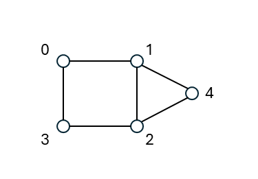

<h1 style="text-align: center;">
QAOA Step by Step: A Closer Look into Cost and Mixer Operators
</h1>

## Introduction

In the [previous post](https://github.com/atulvarshneya/quantum-computing/blob/master/blogs/QAOAblog-01.md), we explored the overall structure of QAOA:
superposition, alternating cost and mixer operators, layered depth, and
classical parameter optimization. We kept the discussion intentionally
at a high-level so we could clearly see the architecture without getting
buried in equations.

Now it's time to zoom in a bit on some mathematical details of the Cost and
Mixer Hamiltonians and their corresponding unitaries used in the QAOA's
quantum circuit. In keeping with our target audience of computer scientists,
software engineers, and technology enthusiasts, we will avoid getting too far into the 
weeds.

We continue to use MAXCUT as the running example to explore QAOA.

## Cost Unitary Operator

### From Classical Cost Function to MAXCUT Cost Hamiltonian

Let's restate the classical MAXCUT objective.
We are given a graph $G = (V,E)$ with a set of vertices $V$, and a set
of edges $E$. We will use $N$ to represent the number of vertices, and $M$ 
the number of edges. The problem involves dividing the vertices into $2$ disjoint sets 
$A$ and $B$. All edges that connect vertices from different sets are said to be cut. The problem is to maximize the total number of edges that are so cut.

To represent the membership to a group, each vertex $i$ is assigned a binary value, 
$x_{i} = 0$ if vertex $i$ is in set $A$, and $x_{i} = 1$ if vertex $i$ is in 
set $B$. 
Hence, an edge $(i,j)$ is said to be cut if $x_{i} \neq x_{j}$. The
total cut value is as given in the equation below, which needs to be maximized.

$$
\begin{equation}
C\left( x \right) = \sum_{\left( i,j \right) \in E}^{}1_{x_{i} \neq x_{j}}
\end{equation}
$$

Note that $1_{x_{i} \neq x_{j}} = 1 \ if \left( x_{i} \neq x_{j} \right),\ 0\ otherwise$. And, $x$ represents $(x_0, x_1, ..., x_{N-1})$.

Our goal now is to convert this purely classical function into a
quantum Hamiltonian operator, $H_{C}$, whose eigenvalues match this cost, i.e., $H_C \ket{x} = C(x) \ket{x}$.
To do this, the key trick is to move from binary values $\{ 0,1\}$ to quantum
eigenvalues $\{ + 1,\  - 1\}$.
Basically, instead of representing a bit $x_{i} \in \left\\{0,1 \right\\}$, we
work with different variables 
$z_{i} \in \left\\{ + 1,\  - 1 \right\\}$, such that the mapping between $x_i$ and $z_i$ is:

$$x_{i} = 0 \Rightarrow z_{i} = + 1$$

$$x_{i} = 1 \Rightarrow z_{i} = - 1$$

Or, in a compact form,

$$z_{i} = \left(-1 \right)^{x_i}$$

Consider an edge between vertices $i$ and $j$. Using the $z_{i}$ representation we see that,

$$\text{If\ }x_{i} = x_{j},then\ z_{i}z_{j} = + 1$$

$$\text{If\ }x_{i} \neq x_{j},then\ z_{i}z_{j} = - 1$$

So, the simple expression $\frac{1}{2} \left( 1 - z_{i}\ z_{j} \right)$ evaluates to $1$ 
if the edge is cut, and $0$ if the edge is not cut. Thus, the total cut value, can be written as

$$
\begin{equation}
C\left( x \right) = \sum_{\left( i,j \right) \in E}^{} \frac{1}{2} (1- z_{i} z_{j})
\end{equation}
$$


### The MAXCUT Cost Hamiltonian

Lets look at the $Z$ quantum operator acting on a single qubit. 

$$Z\ket{0} \rightarrow \ket{0}$$

$$Z\ket{1} \rightarrow -\ket{1}$$

It can be written in a compact form as

$$Z\ket{x_i} \rightarrow \left(-1 \right)^{x_i} \ket{x_i}$$

Now, lets look at two $Z$ operators acting on qubits $i$ and $j$.

$$
Z_i Z_j \ket{x_0 x_1 ... x_{N-1}} \rightarrow \left(-1 \right)^{x_i} \left(-1 \right)^{x_j} \ket{x_0 x_1 ... x_{N-1}}
$$

Converting to $z_i$ variables,

$$
\begin{equation}
Z_i Z_j \ket{x} \rightarrow z_i z_j \ket{x}
\end{equation}
$$

Using this, and using $C(x)$ expressed in $z$ variables, a moments reflection shows that

$$\sum_{\left( i,j \right) \in E}^{} \frac{1}{2} \left(I - Z_i Z_j \right) \ket{x} = \sum_{\left( i,j \right) \in E}^{} \frac{1}{2} \left(\ket{x} - Z_i Z_j \ket{x} \right)
= \sum_{\left( i,j \right) \in E}^{} \frac{1}{2} \left(\ket{x} - z_i z_j \ket{x} \right)$$

$$= \sum_{\left( i,j \right) \in E}^{} \frac{1}{2} \left(1 - z_i z_j \right) \ket{x} = C(x) \ket{x}$$

Therefore, we have the Hamiltonian operator, $H_C \ket{x} = C(x) \ket{x}$, we are looking for -

$$
\begin{equation}
H_C = \sum_{\left( i,j \right) \in E}^{} \frac{1}{2} \left(I - Z_i Z_j \right)
\end{equation}
$$

This Hamiltonian has several desirable properties:

-   It is diagonal in the computational basis.
-   Every basis state $|x\rangle$ is an eigenstate.
-   The eigenvalue equals the cut value of that bitstring, $C(x)$.
-   Each edge contributes locally using only two qubits.

This means the Hamiltonian evaluates the cut value *in parallel for all
possible cuts*.

### From Hamiltonian to Cost Unitary

The time evolution of a quantum state is mathematically represented by a unitary operator. Quantum gates are therefore unitary operators. QAOA uses the following unitary operator derived from the Hamiltonian $H_C$:

$$U_{C}(\gamma) = e^{- \text{iγ}H_{C}}$$

Expanding $H_{C}$,

$$U_{C}\left( \gamma \right) = e^{- i\gamma \sum_{\left( i,j \right) \in E} \frac{1}{2} \left(I - Z_i Z_j \right)} =
\prod_{\left( i,j \right) \in E}^{}e^{- i\gamma\frac{1}{2}\left( I - Z_{i}Z_{j} \right)} = \prod_{\left( i,j \right) \in E}^{}{e^{- i\frac{\gamma}{2}I\ } e^{+ i\frac{\gamma}{2}Z_{i}Z_{j}}}
$$

Ignoring the global phase, as it does not affect measurement, we can express $U_C(\gamma)$ as

$$
\begin{equation}
U_{C}\left( \gamma \right) = \prod_{\left( i,j \right) \in \ E}^{}e^{i\frac{\gamma}{2}\left( Z_{i}\ Z_{j} \right)}
\end{equation}
$$

Note that every edge contributes a two-qubit ZZ rotation gate.

### The Target Gate: A Two-Qubit ZZ Rotation
From the equation written above, it is evident that the operator $U_C(\gamma)$ is simply a 
sequence of application of gates $U_{i,j}(\gamma)$ given below, one for each edge $(i,j) \in E$

$$U_{i,j}\left( \gamma \right) = e^{+ i\frac{\gamma}{2}Z_{i}Z_{j}}$$

Now, since $Z_i Z_j \ket{x} \rightarrow z_i z_j \ket{x}$, therefore

$$
U_{i,j}(\gamma)\ket{x} = e^{+\frac{\gamma}{2}z_i z_j}\ket{x}
$$

So, this gate applies different phases depending on whether the two qubits
are equal or different:

| **State** | **$z_i z_j$** | **Qubits Parity**  | **Phase Applied** |
|:---|:---:|:---:|:---:|
| \|00⟩ | 1 | 0 | $$e^{+ i\frac{\gamma}{2}}$$ |
| \|01⟩ | -1 | 1 | $$e^{- i\frac{\gamma}{2}}$$ |
| \|10⟩ | -1 | 1 | $$e^{- i\frac{\gamma}{2}}$$ |
| \|11⟩ | 1 | 0 | $$e^{+ i\frac{\gamma}{2}}$$ |

The standard identity for implementing this $U_{ij}(\gamma)$ operator is:

$$
\begin{equation}
e^{+ i\frac{\gamma}{2}\ Z_{i}\ Z_{j}} \equiv \text{CNO}T_{i \rightarrow j}\text{\ \ }R_{Z}\left( - \gamma \right)_{j}\ \text{CNOT}_{i \rightarrow j}
\end{equation}
$$

Intuition on what this circuit does conceptually:
- Compute parity of qubits $i$ and $j$: apply $CNOT_{i \rightarrow j}$, qubit $j$ gets the parity value
- Apply a phase depending on parity: apply $R_z$ on qubit $j$
- Uncompute parity: apply $CNOT_{i \rightarrow j}$ again

> **Important detail about sign:**
> By definition, $R_{Z}\left( \theta \right) = e^{- i\frac{\theta}{2}\text{\ Z}}$.
So, to obtain a phase $e^{+ i\frac{\gamma}{2}}$ when qubit is $0$ and $e^{- i\frac{\gamma}{2}}$ when qubit is $1$, we must apply
$R_{Z}\left( - \gamma \right)$. That is why the $R_Z$ angle is
negative in the circuit.

### Building the Full Cost Operator for a Graph

To construct the full cost operator:

- Loop over all edges $(i,j)$ in the graph.
- For each edge, apply the gates
  - $CNOT_{i \rightarrow j}$
  - $R_{Z} \left( - \gamma \right)_{j}$
  - $CNOT_{i \rightarrow j}$.

```python
for (i,j) in edges:
    circuit.CX(i, j)
    circuit.Rz(-gamma, j)
    circuit.CX(i, j)
```

That's all. No large matrices. No exponentials. Just clean, simple gate
operations.

**Circuit Complexity**: 
For a graph with $N$ vertices, $M$ edges, each QAOA cost layer contains
$2M$ CNOT gates, and $M$ $R_Z$ gates. So the circuit depth scales with the
number of edges, not $2^{N}$. This makes QAOA scalable on near-term hardware.

### What the Cost Operator Physically Does

After applying the cost operator, 
$U_{C}(\gamma)\ket{x} \rightarrow e^{- i \gamma H_C}\ket{x} = e^{- i \gamma C\left( x \right)}\ket{x}$,
all $2^{N}$ basis states still exist in superposition, only their phases
change per their cost. Good cuts and bad cuts now carry different quantum phases.

At this stage no probabilities have changed yet, and the "reward signal" 
is encoded entirely in phase. The mixer operator (coming next) 
converts this signal into measurable probability differences.

## Mixer Unitary Operator

The mixer operator allows
QAOA to explore the space of solutions, and it biases the measurements toward good cuts.
To do this the mixer operator does the following:
-   mixes amplitudes between different bitstrings,
-   allows interference between good and bad solutions,
-   and lets probability flow toward better solutions.

### The Standard QAOA Mixer Hamiltonian

The most common and simplest mixer Hamiltonian is:

$$H_{B} = \sum_{i = 1}^{N}X_{i}$$

$X_{i}$ is the Pauli-X operator acting on qubit $i$. Pauli-X is just the quantum version of a bit flip.

The corresponding unitary applied by QAOA is:

$$U_{B}\left( \beta \right) = e^{- i\beta H_{B}} = \prod_{i = 1}^{N}e^{- i\beta X_{i}}$$

This is extremely convenient, because each qubit is acted on
independently.

At this point let us recall a sidebar we saw in the previous companion blog --

> **A sidebar**: The standard mixer unitary causes amplitudes to flow between 
neighboring states, those that differ by a bit flip. And, QAOA 
applies the cost and mixer unitaries multiple times, in $p$ 
layers. Each layer can propagate amplitude further through the 
solution space.
>
> However, keeping circuits shallow is a major goal for QAOA because 
of noise and decoherence in current quantum hardware. So, if you 
need $p\  \approx \ N$, the number of qubits, to reach good states 
that are far apart in Hamming space, that could become problematic as
$N$ grows. Hence there seems to be a tension in QAOA's design.
>
> But please note that for some problems (like MAXCUT), relatively small
$p$ can give good results. For others, you might need $p$ that scales
with $N$, where QAOA can become impractical. This is an area of
active research whether QAOA requires $p = O(N)$, or can succeed
with lower bounds on $p$ such as
$O\left( 1 \right),\ O\left( \text{logN} \right)$, for various problem
classes. There\'s no universal answer. Researchers also explore
problem-specific mixer Hamiltonians that might allow larger \"jumps\"
through the solution space, potentially reducing the required depth of
the circuit.

So, while we mentioned the standard mixer here, there are other mixers
that might work better for a given problem structure. But here we will
stay with this standard mixer for keeping things simple.

### How the Mixer Becomes a Real Circuit

For a single qubit, the operator

$$e^{- i\beta X}$$

is implemented exactly by a rotation around the X-axis of the Bloch
sphere:

$$R_{x}\left( 2\beta \right)$$

So, the entire mixer layer is simply:

-   Apply $R_{x}\left( 2\beta \right)$ to every qubit.

In code, it looks like:

```python
for i in range(N):
    circuit.Rx(2*beta, i)
```

That's it. No CNOTs. No multi-qubit gates. Just clean, parallel
single-qubit rotations.

### What the Mixer Physically Does

While Pauli-X flips qubits, $X \ket{0} \rightarrow \ket{1}$, and $X \ket{1}  \rightarrow \ket{0}$, an X-rotation doesn't just flip, it creates superpositions of flipped
and unflipped states. That means:
-   Amplitude flows between states that differ by one bit flip.
-   Over multiple layers, amplitude can propagate between all
    bitstrings.

This gives the mixer a very clear physical meaning -- the mixer defines
the "allowed directions of movement" in the solution space. With the
standard mixer, QAOA explores the solution space by walking through
the hypercube of bitstrings one bit at a time.

### Mixer Is Problem-Independent

One aspect to note in QAOA is that while the cost operator depends on the problem (MAXCUT in our case), the mixer operator does not.

The same mixer Hamiltonian $H_{B} = \sum_{}^{}X_{i}$ is used for:
-   MAXCUT
-   Max-SAT
-   graph coloring
-   scheduling
-   and many other unconstrained optimization problems.

This separation is one of the reasons QAOA is modular and
reusable.

## Putting it All Together: An Illustrative QAOA Quantum Circuit

At this point, we have fully specified the QAOA layer -- the cost unitary followed by the mixer unitary. We have also seen how each of these unitaries are realized in quantum circuits.

The full circuit for QAOA is put together as:

1.  **Superposition:** setup full superposition

    i.  apply hadamard to all N qubits

2.  **QAOA layers:** each state given a phase based on its cost value, create interference to increase amplitudes of good states, and reduce it for bad states

    i.  For every edge $(i,j)$, apply the sequence of gates: 
    $CNOT(i \rightarrow j)\ \ Rz( - \gamma)\ \ CNOT(i \rightarrow j)$

    ii.  For every qubit $i$, apply: $Rx(2\beta)$

    iii. and, repeat this pair of operators $p$ times.

3. **Perform Measurement operation:** run the circuit multishot to get estimate of probability distribution

### An Illustrative QAOA Quantum Circuit

Finally, to illustrate a realistic circuit, below is an example of a QAOA 
circuit for 5-node graph with edges (0,1), (1,2), (2,3), (3,0), (1,4), and (4,2).



For simplicity of illustration the circuit has just 1 QAOA layer.

```text
q000 -[H]--#-[.]------[.]---------------------------[X]-[Rz]-[X]----------------------------#-[Rx]--#-[M]-
           #  |        |                             |        |                             #       #  |  
q001 -[H]--#-[X]-[Rz]-[X]-[.]------[.]---------------|--------|--[.]------[.]---------------#-[Rx]--#-[M]-
           #               |        |                |        |   |        |                #       #  |  
q002 -[H]--#--------------[X]-[Rz]-[X]-[.]------[.]--|--------|---|--------|--[X]-[Rz]-[X]--#-[Rx]--#-[M]-
           #                            |        |   |        |   |        |   |        |   #       #  |  
q003 -[H]--#---------------------------[X]-[Rz]-[X]-[.]------[.]--|--------|---|--------|---#-[Rx]--#-[M]-
           #                                                      |        |   |        |   #       #  |  
q004 -[H]--#-----------------------------------------------------[X]-[Rz]-[X]-[.]------[.]--#-[Rx]--#-[M]-
           #                                                                                #       #  |  
creg ======#================================================================================#=======#==v==
           #                                                                                #       #
```

## Getting Hands-on with QAOA Implementation in Python

It's a good time now to see the code in action, you can explore a
complete Python implementation of QAOA for MAXCUT
[here](https://github.com/atulvarshneya/quantum-computing/blob/master/examples/qckt/Well-Known%20Algorithms/QAOA-maxcut.ipynb).
This Python notebook walks through all the major ideas behind QAOA in a
tutorial format, building the algorithm step by step and showing exactly
how the circuit behaves.

The implementation runs on
[Qucircuit](https://github.com/atulvarshneya/quantum-computing/tree/master),
a full-featured quantum computing simulator that I developed to support
educational and experimental work in quantum algorithms. You can install
Qucircuit in just a few seconds using:

```shell
pip install qucircuit
```

Once installed, you can run the entire QAOA implementation locally on
your own computer and experiment with it at your own pace.
